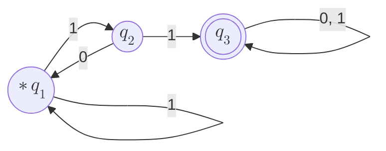

Sumário:
- [Exemplos de diagrama mermaid](#exemplos-de-diagrama-mermaid)
- [Titulo](#titulo)
  - [subtitulo](#subtitulo)

# Exemplos de diagrama mermaid

# Titulo

$\frac{A}{B}$

## subtitulo

teste