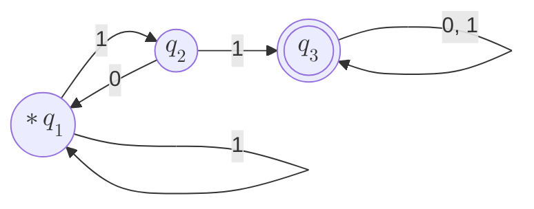

Resumo baseado no livro *SIPSER, M. Introduction to the theory of computation, 3rd ed. Boston: Cengage Learning, 2012.*

Notas:
- Utilizam-se diagramas Flowchart do [Mermaid](https://mermaid.js.org/) para representar os autômatos graficamente;
- Os diagramas de autômatos possuem um asterisco (`*`) para indicar o estado inicial.

Exemplo de autômato feito com Mermaid:
